# Desarrollo-para-Moviles

### Trabajo Integrador - Desarrollo para Móviles (Pochocleando 📽️)

# Índice

1. [Integrantes del Proyecto](#integrantes-del-proyecto)
2. [Descripción del Proyecto](#descripción-del-proyecto)
3. [Objetivo](#objetivo)
4. [Descripción de Pantallas](#descripción-de-pantallas)
5. [Funcionalidades Implementadas](#funcionalidades-implementadas)
6. [Estructura del Proyecto](#estructura-del-proyecto)
7. [Dependencias](#dependencias)
8. [Instalación y Configuración](#instalación-y-configuración)
9. [Uso del Proyecto](#uso-del-proyecto)
10. [Capturas de Pantallas](#capturas-de-pantallas)
11. [Licencia](#licencia)

## Integrantes del Proyecto

- **Mauro Alejandro Gerardi**

- **Javier Ignacio Gerol**

- **Brian Leonel Retamar**

## Descripción del Proyecto

Este proyecto es una aplicación móvil desarrollada con **React Native** utilizando **Expo** como framework.  

Incluye integración con **React Navigation** para la navegación, **Formik** y **Yup** para la validación de formularios, y **react-native-maps** para la visualización de mapas.

**Pochocleando** será una aplicación móvil que permitirá a los usuarios explorar, buscar y descubrir películas y series de televisión utilizando la API de TMDb como fuente de información principal. La aplicación brindará acceso a datos completos y actualizados, incluyendo sinopsis detalladas, reparto, calificaciones, tráilers, imágenes y recomendaciones personalizadas según los intereses del usuario.

Además, integrará funcionalidades de geolocalización para que el usuario pueda encontrar los cines más cercanos a su ubicación en tiempo real, visualizar sus funciones disponibles y recibir notificaciones locales sobre estrenos relevantes.

## Objetivo

El objetivo es facilitar el acceso a **información completa, precisa y actualizada** sobre películas y series,
y ofrecer herramientas para que los usuarios puedan descubrir nuevos títulos, mantenerse
al día con los estrenos y planificar visitas a cines cercanos.

- Permitir la búsqueda de películas y series por título, género o popularidad.

- Mostrar detalles completos: sinopsis, reparto, calificación, tráilers e imágenes.

- Localizar cines cercanos y mostrar horarios de funciones mediante geolocalización y mapas.

- Guardar películas favoritas en una lista personalizada.

- Enviar notificaciones para estrenos, funciones cercanas y recomendaciones.

- Ofrecer reseñas y valoraciones personalizadas por parte de los usuarios.

## Descripción de Pantallas

A continuación, se describen las pantallas principales de la aplicación:

1. **Login**  
   - Permite a los usuarios iniciar sesión en la aplicación con sus credenciales.  
   - Incluye validación de datos y mensajes de error si los datos ingresados son incorrectos.

2. **Registro**  
   - Permite a los nuevos usuarios crear una cuenta proporcionando nombre, apellido, correo y contraseña.  
   - Valida que todos los campos sean correctos y muestra errores en caso de ser necesario.

3. **Pantalla de Inicio / Home**  
   - Muestra un buscador de películas y series.  
   - Incluye dos secciones destacadas: “Qué ver hoy” y “Estrenos”.  
   - Muestra un mapa general con los cines cercanos a la ubicación del usuario.

4. **Pantalla de Películas**  
   - Lista de películas disponibles con filtros por género, popularidad y calificación.  
   - Permite seleccionar una película para ver más detalles.

5. **Pantalla de Series**  
   - Lista de series disponibles con filtros por género, popularidad y calificación.  
   - Permite seleccionar una serie para ver más detalles.

6. **Pantalla de Detalles de Película / Serie**  
   - Muestra información detallada de la película o serie seleccionada: título, puntuación, descripción, reparto y tráiler integrado.  
   - Permite reproducir el tráiler mediante un player de YouTube.

7. **Pantalla de Cines Cercanos**  
   - Muestra un mapa con los cines cercanos a la ubicación del usuario.  
   - Permite seleccionar un cine para ver más detalles y su navegación en Google Maps.

8. **Pantalla de Detalle del Cine Seleccionado**  
   - Muestra información específica del cine seleccionado: nombre, ubicación y funciones disponibles.  
   - Permite abrir la ubicación directamente en Google Maps para navegar.

9. **Pantalla de Perfil**  
   - Muestra los datos personales del usuario (nombre, correo, foto de perfil).  
   - Permite subir o cambiar la foto de perfil.  
   - Incluye la opción de cerrar sesión.

## Funcionalidades Implementadas

- **Integración con APIs externas**  
  - Se obtiene información de películas y series (sinopsis, reparto, calificación, tráilers) usando `tmdbService`.  
  - Los trailers se reproducen directamente con `react-native-youtube-iframe`.

- **Geolocalización y Mapas**  
  - La app usa `react-native-maps` para mostrar cines cercanos y mapas generales.  
  - Permite abrir la navegación hacia un cine específico en Google Maps.

- **Navegación**  
  - Implementada con `@react-navigation/native` y `@react-navigation/native-stack` para la navegación entre pantallas.

- **Gestión de formularios y validaciones**  
  - Formularios de login y registro gestionados con **Formik** y validados con **Yup**.

- **Notificaciones y favoritos**  
  - Funcionalidad para guardar películas y series favoritas.  
  - Notificaciones opcionales para estrenos o eventos implementado con `expo-notifications`.

- **Carga y visualización de trailers**  
  - Se obtienen los trailers de YouTube asociados a la película/serie seleccionada y se reproducen dentro de la app.  
  - Manejo de estado de carga y disponibilidad del trailer.

- **Perfil de usuario**  
  - Permite actualizar datos personales y foto de perfil.  
  - Opción de cerrar sesión y mantener persistencia de la sesión.

---

## Estructura del Proyecto

- `app/components/`: Componentes reutilizables dentro de las pantallas.  
- `app/navigation/`: Configuración del ruteo y navegación de la app.  
- `app/screens/`: Archivos de las pantallas principales mencionadas.  
- `app/services/`: Servicios para consumir APIs y manejar la lógica de datos.

## Dependencias

Este proyecto utiliza varias librerías esenciales para su correcto funcionamiento:

### Librerías para el usuario final

- **@expo/vector-icons**: Proporciona una amplia variedad de iconos personalizables que se utilizan para mejorar la interfaz gráfica de la aplicación.

- **@react-native-async-storage/async-storage**: Permite almacenar datos de manera persistente en el dispositivo, utilizado para guardar configuraciones y datos de usuario.

- **@react-navigation/bottom-tabs**: Implementa una barra de navegación inferior para facilitar la navegación entre diferentes pantallas de la app.

- **@react-navigation/native**: Es el núcleo de la navegación en React Native, manejando la estructura y el historial de navegación.

- **@react-navigation/native-stack**: Ofrece una pila de navegación optimizada para el rendimiento nativo en dispositivos móviles.

- **axios**: Librería para realizar peticiones HTTP, utilizada para comunicarse con APIs externas.

- **expo**: Framework que facilita el desarrollo de aplicaciones React Native con herramientas y servicios integrados.

- **expo-camera**: Proporciona acceso a la cámara del dispositivo para capturar fotos y videos dentro de la app.

- **expo-constants**: Permite acceder a constantes del sistema y configuración del entorno de ejecución.

- **expo-image-picker**: Facilita la selección de imágenes desde la galería o la cámara del dispositivo.

- **expo-linear-gradient**: Permite crear fondos con degradados lineales para mejorar el diseño visual.

- **expo-location**: Proporciona servicios de geolocalización para obtener la ubicación del usuario.

- **expo-status-bar**: Controla la apariencia de la barra de estado del sistema operativo.

- **firebase**: Plataforma para servicios backend como autenticación, base de datos y almacenamiento en la nube.

- **formik**: Biblioteca para manejar formularios de manera sencilla y eficiente, incluyendo validación.

- **react**: Biblioteca base para construir interfaces de usuario.

- **react-native**: Framework para construir aplicaciones móviles nativas usando JavaScript y React.

- **react-native-dotenv**: Permite manejar variables de entorno en proyectos React Native.

- **react-native-keyboard-aware-scroll-view**: Ajusta automáticamente la vista cuando el teclado aparece para evitar que los campos de texto queden ocultos.

- **react-native-maps**: Componente para integrar mapas interactivos en la aplicación.

- **react-native-safe-area-context**: Maneja las áreas seguras de la pantalla en dispositivos con notch o bordes redondeados.

- **react-native-screens**: Optimiza la gestión de pantallas para mejorar el rendimiento de la navegación.

- **react-native-webview**: Permite incrustar contenido web dentro de la aplicación.

- **react-native-youtube-iframe**: Componente para reproducir videos de YouTube usando iframes.

- **yup**: Librería para validación de esquemas de datos, utilizada junto con Formik para validar formularios.


### Librerías de desarrollo

- **@types/react**: Proporciona definiciones de tipos TypeScript para React, facilitando el desarrollo con tipado estático.

- **typescript**: Lenguaje de programación que añade tipado estático a JavaScript, mejorando la calidad y mantenibilidad del código.

## Instalación y Configuración

Para instalar y configurar el proyecto, sigue estos pasos:

1. **Clona el repositorio**

   ```bash
   git clone https://github.com/Maure-dev/Desarrollo-para-Moviles.git
   ```

2. **Instala las dependencias**

   ```bash
   npm install
   ```

3. **Inicia el servidor**

   ```bash
   npx expo start
   ```

## Uso del Proyecto

Una vez iniciado el proyecto, puedes acceder a la página principal escaneando el código QR generado en la terminal con la aplicación de la cámara nativa de su celular y la aplicación **Expo Go** previamente instalada desde la App Store o Play Store. Si haces cambios en el proyecto, el servidor se reiniciará automáticamente.

## Capturas de Pantallas

1. **Login**  

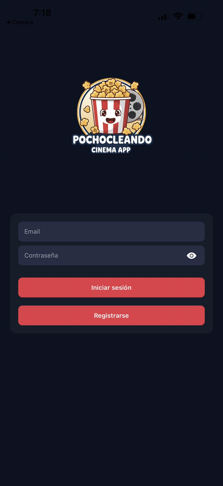

2. **Registro**  

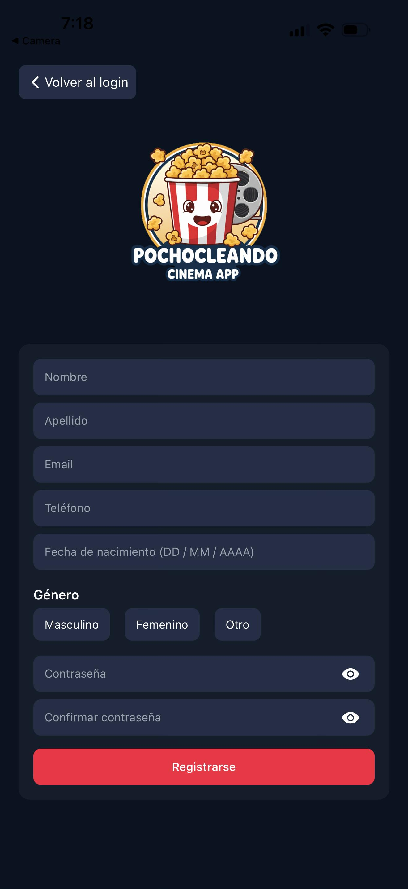

3. **Pantalla de Inicio / Home**

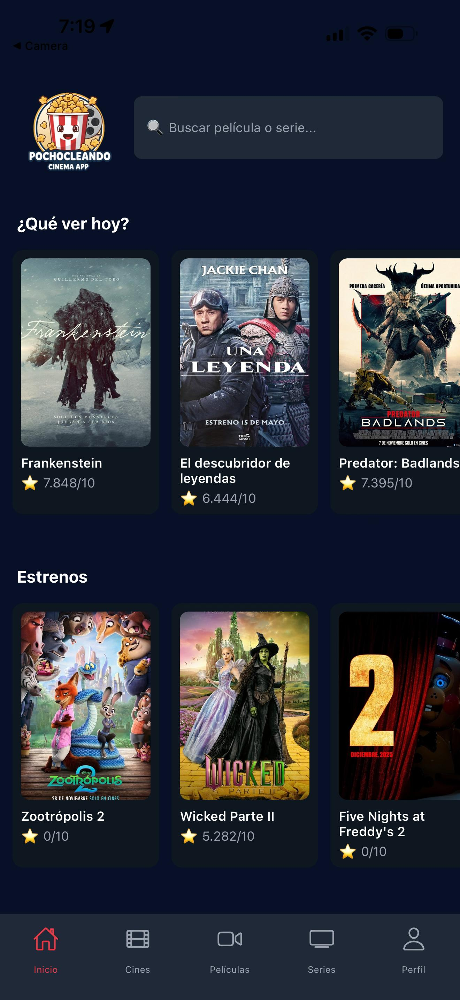

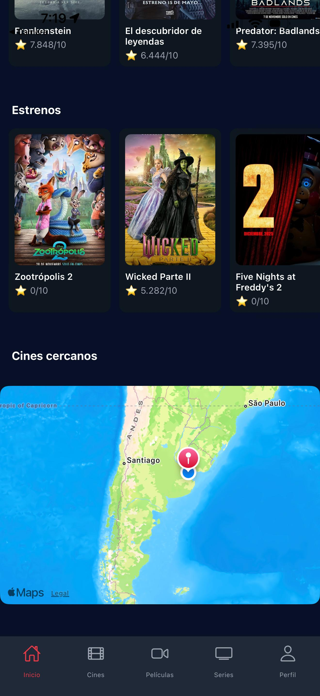

4. **Pantalla de Películas** 

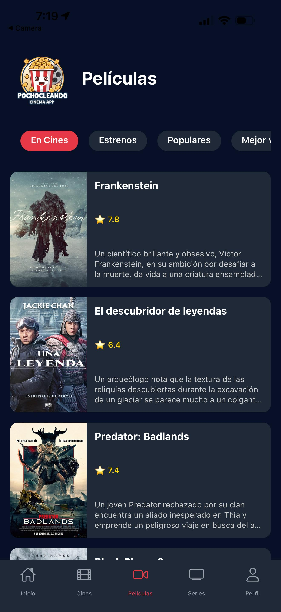

5. **Pantalla de Series**  

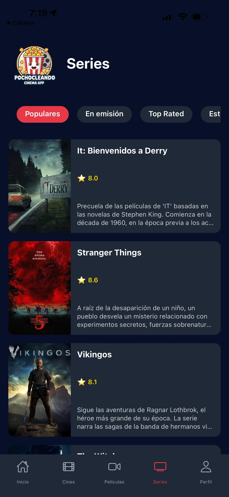

6. **Pantalla de Detalles de Película / Serie**  


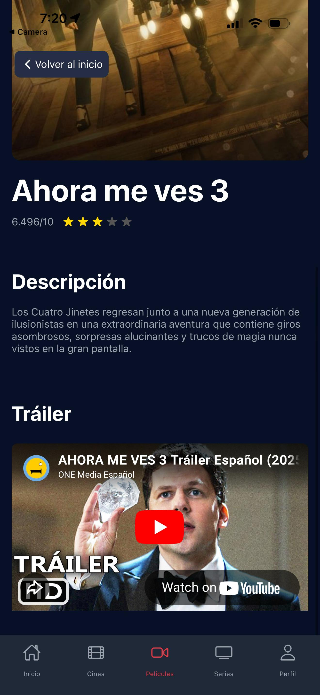

7. **Pantalla de Cines Cercanos**  

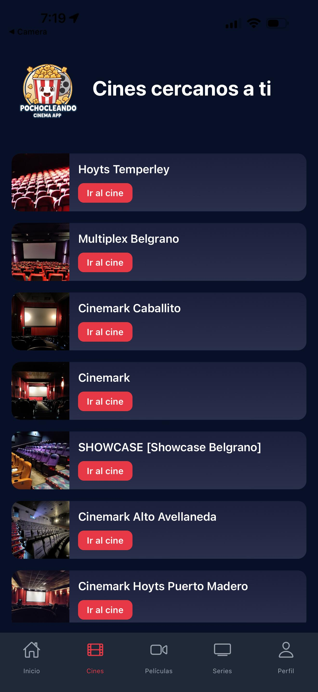

8. **Pantalla de Detalle del Cine Seleccionado**  

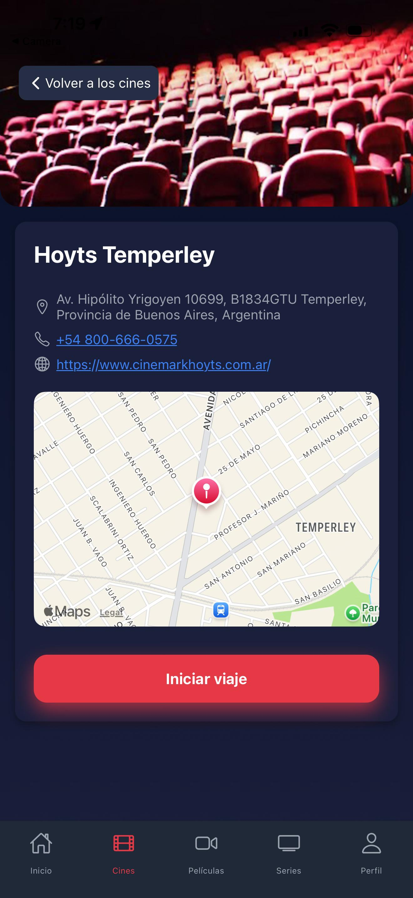

9. **Pantalla de Perfil**  

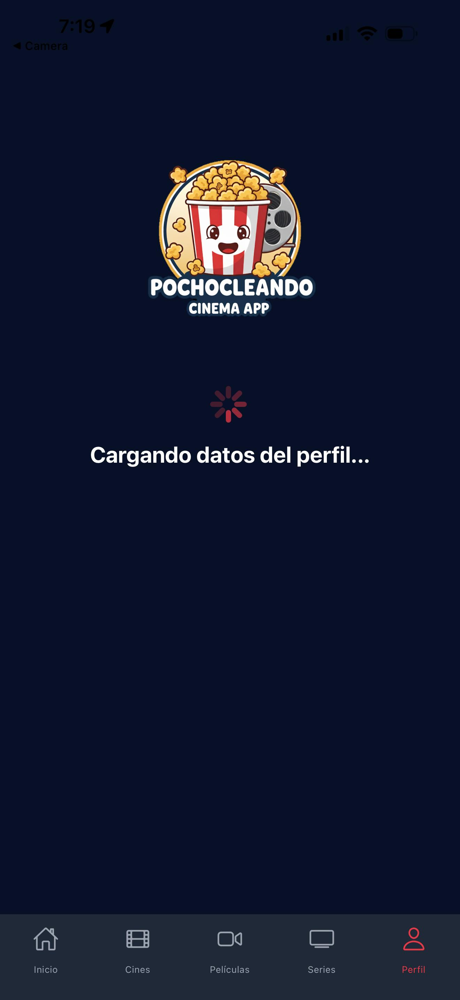

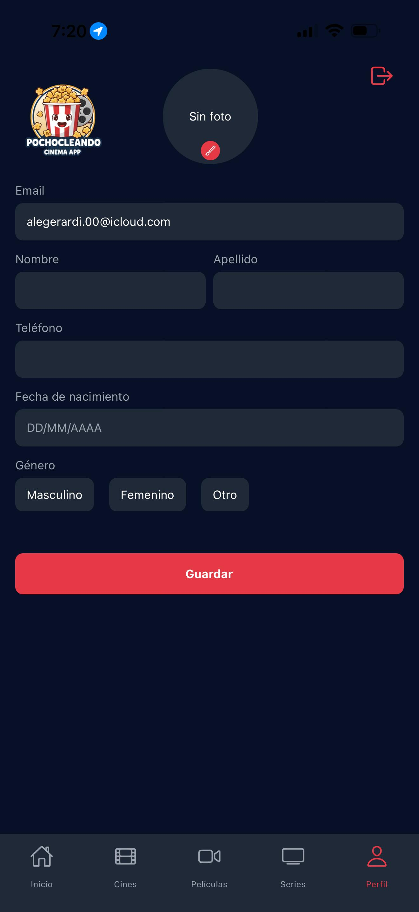

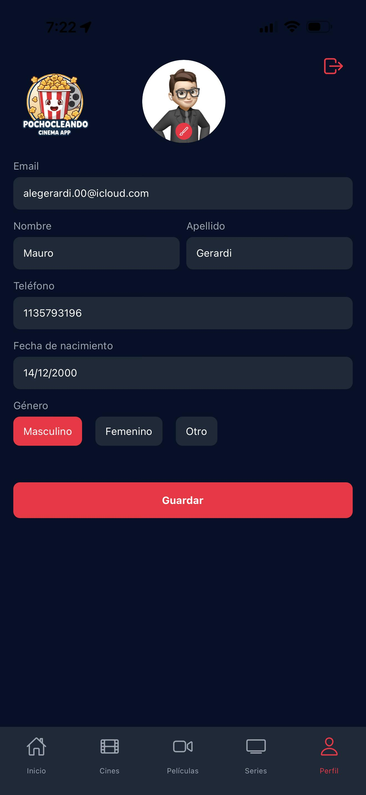

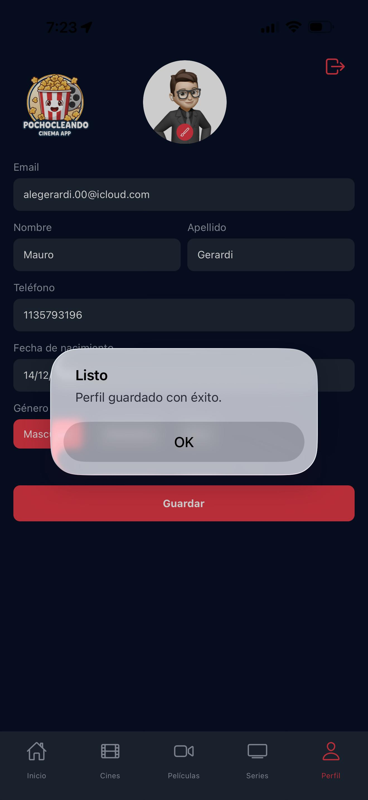

## Licencia

Este proyecto está bajo la Licencia MIT. Véase el archivo LICENSE.
